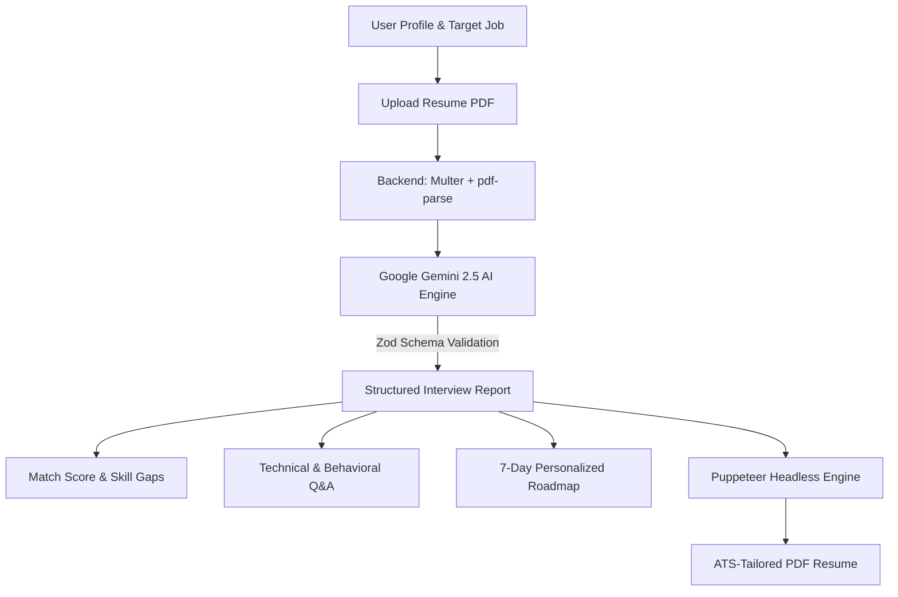

# 🚀 AI Career Coach & ATS Interview Preparation Platform

An intelligent, full-stack AI-powered career assistant that analyzes your resume against target job descriptions to deliver deep match scoring, customized technical & behavioral interview questions, skill gap analysis, a personalized 7-day preparation roadmap, and ATS-optimized tailored resume generation.

---

## 📑 Table of Contents

- [Overview](#-overview)
- [Key Features](#-key-features)
- [Architecture & Tech Stack](#-architecture--tech-stack)
- [Project Structure](#-project-structure)
- [Getting Started](#-getting-started)
  - [Prerequisites](#prerequisites)
  - [Installation](#installation)
  - [Environment Configuration](#environment-configuration)
  - [Running the Application](#running-the-application)
- [API Documentation](#-api-documentation)
- [Workflow Diagram](#-workflow-diagram)
- [Security & Best Practices](#-security--best-practices)

---

## 🌟 Overview

Preparing for technical interviews and tailoring resumes for specific job descriptions can be tedious and stressful. This platform leverages **Google Gemini AI** and **Puppeteer** to provide automated, actionable career insights:

1. **Resume & Job Match Scoring:** Evaluates candidate fit against job requirements with detailed breakdown.
2. **Targeted Interview Prep:** Generates role-specific technical and behavioral questions, complete with the interviewer's hidden intentions and structured answering frameworks (e.g., STAR technique).
3. **Skill Gap Analysis:** Highlights exact technical competencies missing from your profile with priority/severity levels.
4. **Structured 7-Day Roadmap:** Builds a day-by-day personalized learning and practice guide.
5. **ATS-Optimized Resume Export:** Dynamically produces clean, single-page, ATS-compliant PDF resumes tailored to match target job keywords.

---

## ✨ Key Features

- **🔐 Secure Authentication:** User registration, login, and session management using JWT stored in HTTP-only cookies, password hashing with `bcryptjs`, and token blacklisting for safe logout.
- **📄 Resume PDF Extraction:** Fast server-side parsing of uploaded candidate resumes using `pdf-parse` and `multer`.
- **🤖 Gemini AI Structured Outputs:** Powered by Google's Gemini Flash models with strict `zod` schema validation to guarantee reliable, structured JSON responses.
- **📅 7-Day Day-by-Day Preparation Plan:** Actionable daily milestones and tasks tailored to bridge identified skill gaps.
- **🎯 Dynamic ATS Resume PDF Builder:** Generates high-standard, ATS-optimized PDFs compiled via headless Chromium (`puppeteer`).
- **🎨 Interactive Modern UI:** Sleek frontend built with React 19, Vite, SCSS, Lucide icons, responsive dashboard layouts, and interactive progress trackers.

---

## 🛠️ Architecture & Tech Stack

### Frontend
- **Framework:** [React 19](https://react.dev/) + [Vite](https://vitejs.dev/)
- **Routing:** [React Router](https://reactrouter.com/)
- **Styling:** Modular SCSS / SASS
- **Icons & Effects:** [Lucide React](https://lucide.dev/), [Canvas Confetti](https://www.npmjs.com/package/canvas-confetti)
- **HTTP Client:** [Axios](https://axios-http.com/)

### Backend
- **Runtime:** [Node.js](https://nodejs.org/) & [Express 5](https://expressjs.com/)
- **Database & ODM:** [MongoDB](https://www.mongodb.com/) via [Mongoose](https://mongoosejs.com/)
- **AI Integration:** Google Gemini SDK (`@google/genai`)
- **Schema Validation:** [Zod](https://zod.dev/) & [zod-to-json-schema](https://www.npmjs.com/package/zod-to-json-schema)
- **PDF Generation & Parsing:** [Puppeteer](https://pptr.dev/), [pdf-parse](https://www.npmjs.com/package/pdf-parse), [Multer](https://github.com/expressjs/multer)
- **Authentication:** [JSON Web Tokens (JWT)](https://jwt.io/), [bcryptjs](https://www.npmjs.com/package/bcryptjs), [cookie-parser](https://www.npmjs.com/package/cookie-parser)

---

## 📂 Project Structure

```text
├── ai-roadmap/
│   ├── Backend/
│   │   ├── src/
│   │   │   ├── config/          # MongoDB connection & configurations
│   │   │   ├── controllers/     # Auth & Interview request handlers
│   │   │   ├── middlewares/     # Auth verification & Multer file uploads
│   │   │   ├── models/          # Mongoose Schemas (User, InterviewReport, Blacklist)
│   │   │   ├── routes/          # REST API route declarations
│   │   │   └── services/        # Gemini AI prompt engine & Puppeteer PDF generator
│   │   ├── .env.example         # Environment template
│   │   ├── package.json
│   │   └── server.js            # Express server entry point
│   │
│   └── Frontend/
│       ├── src/
│       │   ├── components/      # Shared reusable UI elements
│       │   ├── features/        # Feature-based modules (auth, interview)
│       │   ├── hooks/           # Custom React hooks
│       │   ├── style/           # Global styles and SCSS variables
│       │   ├── App.jsx
│       │   └── main.jsx
│       ├── package.json
│       └── vite.config.js
│
├── package.json                 # Monorepo root workspace orchestrator
└── README.md                    # Project documentation
```

---

## 🚀 Getting Started

### Prerequisites

- [Node.js](https://nodejs.org/) (v18 or higher recommended)
- [MongoDB](https://www.mongodb.com/) (Local instance or MongoDB Atlas cluster URI)
- [Google Gemini API Key](https://aistudio.google.com/)

---

### Installation

Clone the repository and install all dependencies for both Frontend and Backend from the root:

```bash
# Install workspace dependencies
npm run install:all
```

Or install them individually:
```bash
# Backend
cd ai-roadmap/Backend
npm install

# Frontend
cd ../Frontend
npm install
```

---

### Environment Configuration

Create a `.env` file in the `ai-roadmap/Backend` directory (or use `.env.example` as a template):

```env
PORT=3000
MONGO_URI=mongodb+srv://<username>:<password>@<cluster>.mongodb.net/<database>?retryWrites=true&w=majority
JWT_SECRET=your_jwt_super_secret_key_here
GOOGLE_GENAI_API_KEY=your_gemini_api_key_here
```

---

### Running the Application

You can launch both servers concurrently from the project root:

```bash
# Start the Backend Server (Port 3000)
npm run dev:backend

# Start the Frontend Vite Dev Server (Port 5173)
npm run dev:frontend
```

Once running:
- **Frontend:** Open [http://localhost:5173](http://localhost:5173)
- **Backend API:** Live at [http://localhost:3000](http://localhost:3000)

---

## 📡 API Documentation

### Authentication Routes (`/api/auth`)

| Method | Endpoint | Description | Access |
|---|---|---|---|
| `POST` | `/api/auth/register` | Register a new user account | Public |
| `POST` | `/api/auth/login` | Authenticate user & set JWT cookie | Public |
| `GET`  | `/api/auth/logout` | Logout user & invalidate token | Private |
| `GET`  | `/api/auth/profile` | Get current user's profile | Private |

### Interview & Career Routes (`/api/interview`)

| Method | Endpoint | Description | Access |
|---|---|---|---|
| `POST` | `/api/interview/` | Generate interview report (Accepts `multipart/form-data`: `resume`, `jobDescription`, `selfDescription`) | Private |
| `GET`  | `/api/interview/` | Retrieve all past interview reports for current user | Private |
| `GET`  | `/api/interview/report/:interviewId` | Retrieve detailed interview report by ID | Private |
| `POST` | `/api/interview/resume/pdf/:interviewReportId` | Generate & download ATS-optimized PDF resume | Private |

---

## 🔄 Workflow



---

## 🔒 Security & Best Practices

- **Credentials Safety:** Sensitive keys and connection strings are managed strictly through `.env` and kept out of version control.
- **JWT Invalidation:** Revoked tokens upon logout are stored in a MongoDB `blacklist` collection with TTL indexing for automatic cleanup.
- **Schema Validation:** Strict runtime data validation ensures prompt outputs strictly conform to UI-safe schemas.
- **File Upload Guardrails:** In-memory PDF streaming prevents untrusted file persistence on disk.

---

## 📜 License

This project is licensed under the [ISC License](LICENSE).
